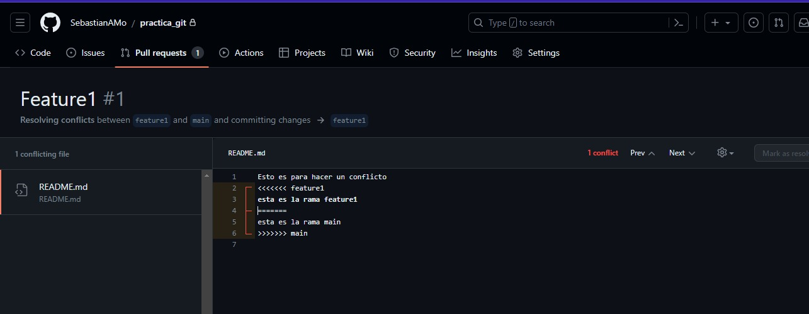
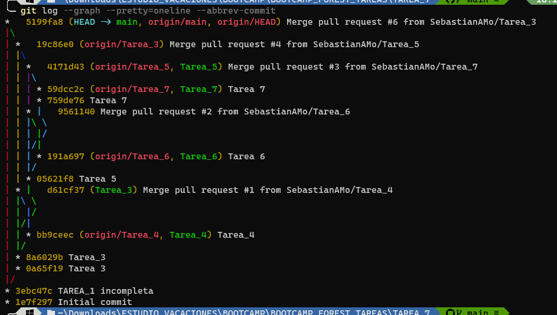

# Evidencia

## A qué no puedes hacer esto antes de la siguiente clase 👀

- Con tu cuenta de GitHub, crea un repósitorio y genera un "merge conflict" 😭, documenta el proceso para generarlo 🗒️ y la forma en la que lo solucionaste ✔️

- Genera al menos 3 ramas y crea commits diferentes en cada una 😱 hasta que el árbol de git se vea muy adelantado (Como con la imagen de las features) 👈🏻 En una de las ramas, has un merge y muéstranos como quedó ese árbol 🌳.

