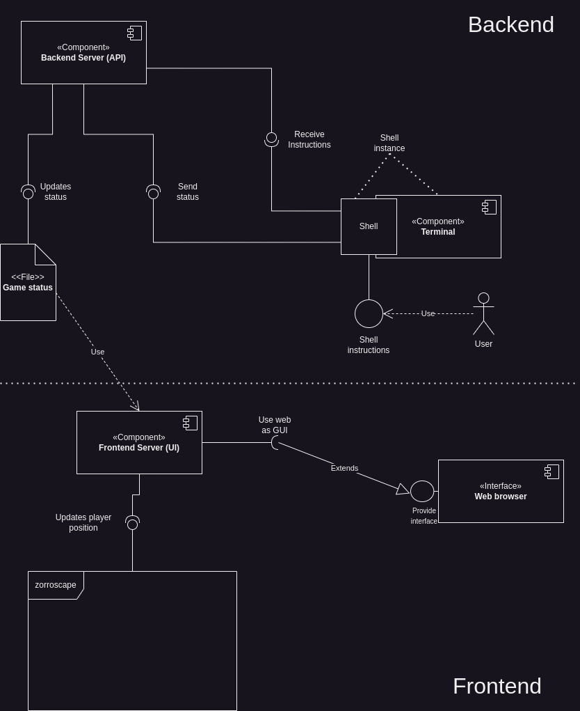
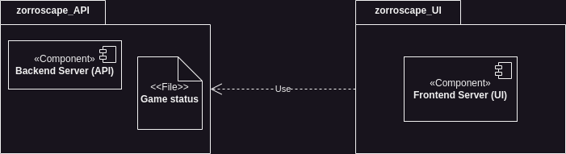
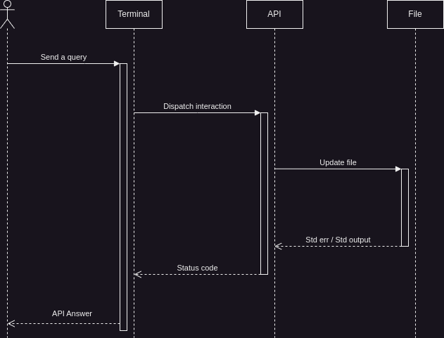
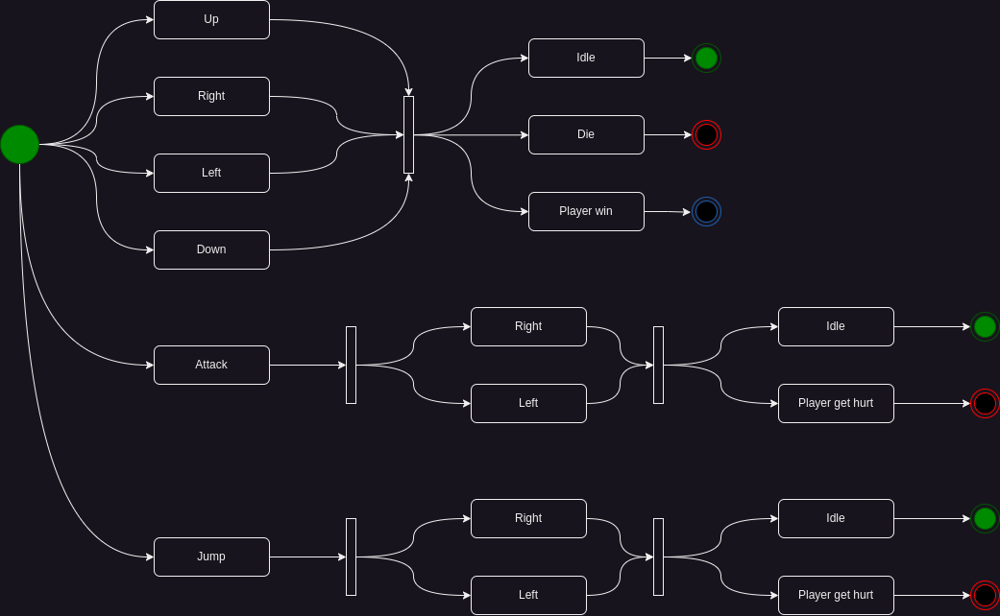

# Assigment #10

Vamos a retomar cositas de planificación antes de irnos de lleno a la codificación 🌲 Hay 2 formas de hacer esto, cumplir porque si o ayudarte a ti mism@ para el futuro 💫, la idea será la siguiente:

Tomando los 4 diagramas de más abajo 🗺 debes de construir un "plan" de trabajo, para eso has de escribir todos los tickets 🎟 que encuentres entre los diagramas. Ten en cuenta que yo estimo unos 15, pero puede que tú encuentres más o menos 👍 no hay lío si te salen 20 u 8, el reto de esto es identificar las tareas que se necesitan 🎯

