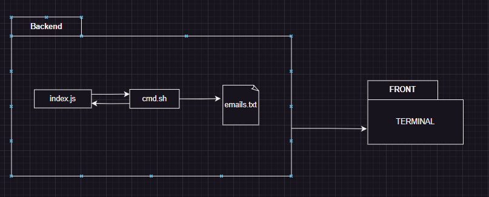
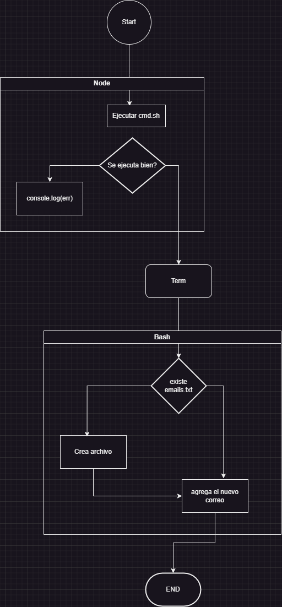
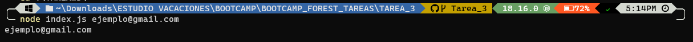

# Assignment #3

Contexto 🌲: Hay muchas arquitecturas de software que me sirven para llamar, invocar o usar una funcionalidad de otro lenguaje  🐜 una de esas formas la vimos en la sesión de hace unos días, por lo que hay que practicarlo 💪🏻

Objetivo 🎯: Hacer un ejemplo de implementación basándose en UML 👁️

Tener en cuenta 🚨: La idea de esta práctica es poder usar 2 archivos para lograr una funcionalidad tan grande como quieras (Puede ser solo imprimir un texto)

Nota: Hay 2 maneras de hacer esto, hacerlo bien o hacerlo mal.

- Haciéndolo mal ❌: Haces primero el código y luego haces el UML

- Haciendo bien ✔️: Haces primero el UML y luego el código

## Implementación

- Frontend: El terminal es el frontend, el usuario ingresa un comando en el terminal para ejecutar el script index.js, proporcionando un correo electrónico como argumento, el script index.js se ejecuta en el backend y se comunica con el script cmd.sh.

- Backend: El script cmd.sh crea un archivo llamado "emails.txt" si no existe, el correo electrónico proporcionado como argumento se agrega al archivo "emails.txt", el contenido del archivo "emails.txt" se muestra en el frontend.

### Diagrama de paquetes

### Diagrama de flujo

### Resultado

