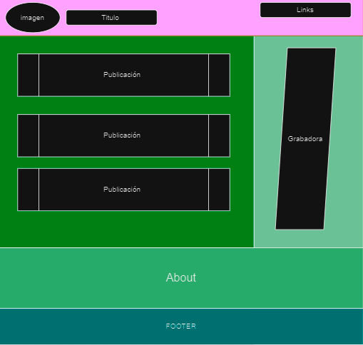

# Assignment #14

Ya que hemos visto varias maneras de como se hace frontend, algo de CSS, algo de HTML y algo de JS para el frontend ¿Y si mezclamos todo? ⛳️

🌲 Maqueta como quieres que se vea tu blog (Recuerda que lo mencionamos en la última sesión); como consejo sería bueno usar un mapa de topografía 🍃

🌲 Crear una pequeña esctructura de como harás tu layout en HTML 🍃

🌲 Crear una pequeña esctructura de como harás tu layout en CSS 🍃

## Link

<https://github.com/SebastianAMo/BOOTCAMP_FOREST_TAREAS/blob/main/tarea_14>

## Maqueta

