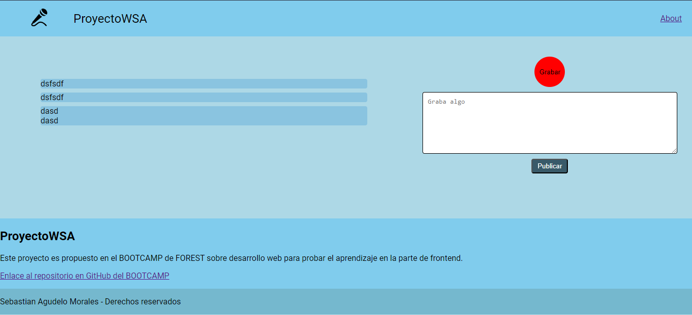

# Assignment #15

Ahora que ya tienes una estructura, sería bueno agregar algo de estetica ¿No crees?,
CSS es tan usualmente complicado como uno mismo quiera hacerlo, pero; las paginas,
los sitios y las apps en web son visualmente atractivas.

Para practicar esto ⛳️ usaremos una serie de recursos:

🌲 [Usaremos una fuente](https://fonts.google.com/)

🌲 [Deberíamos definir una paleta de colores](https://color.adobe.com/es/create/color-wheel)

🌲 [Un estilo para la lo que hemos hecho](https://www.crehana.com/blog/estilo-vida/tendencias-ux-ui/)

🌲 [Un poco de interactividad](https://animate.style/)

🌲 [Y una arquitectura](https://en.bem.info/methodology/)

Con todo ellos, solo has de procurar que sea esteticamente atractivo lo que diseñes,
a este punto no deberías necesitar algo más que CSS, pero si deseas puedes combinar
los estilos con algo de JS para agregar más interactividad

## Link

<https://github.com/SebastianAMo/BOOTCAMP_FOREST_TAREAS/blob/main/tarea_15>

## Maqueta

