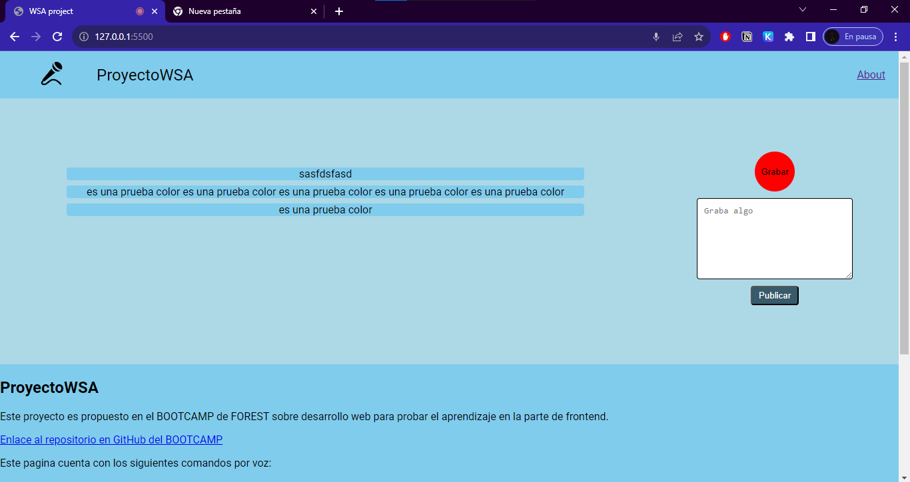

# Assignment #16

    <i >
        "La voz humana es el instrumento más bello... Pero el más dificil de tocar"
    </i>

Richard Strauss

Si, usaremos la voz, ¿Por qué no hacerlo? La usamos todos los días, solo que; como
decía Strauss eso es dificil, en frontend lo "dificil" es sinonimo de JS/TS. Así que
has de usar la Web Speech API, la cual viene por defecto en la web.

Para esta practica debes usar:

⛳️ [Web Speech API](https://developer.mozilla.org/en-US/docs/Web/API/Web_Speech_API)

⛳️ [Browser Compatibility](https://developer.mozilla.org/en-US/docs/Web/API/Web_Speech_API#browser_compatibility)

⛳️ [JS is all you need](https://github.com/F-O-R-E-S-T/web-bootcamp-2023/tree/main/bloque_4_frontend/03_JS_is_all_you_need)

Obviamos todo esto debes hacerlo con JS; una vez hayas completado estos requerimientos minimos, tendrás un proyecto funcional.

El objetivo será:

🌲 Crear un "blog" en el cual tendrás que poder agregar conteidos mediante la voz a
un pequeño input de "preview"

🌲 En ese preview debes de poder editar y corregir el texto

🌲 El texto que generes debe de poder interpretarse con comando y algunas utilidades
por el estilo

🌲 Es importante que uses un proxy para enriquecer tu manera de escribir, así agregando
algunas comandos, la manera en la que los agreges va en ti, pero debes tener minimo 5
comando diferentes por voz que modifiquen algo en los textos, blog o pagina

## Link

<https://github.com/SebastianAMo/BOOTCAMP_FOREST_TAREAS/blob/main/tarea_16>

## Evidencia

